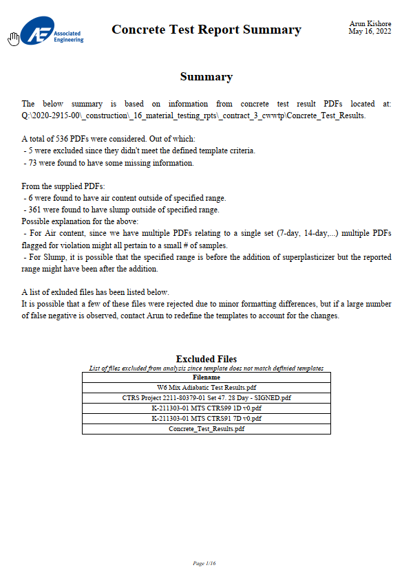
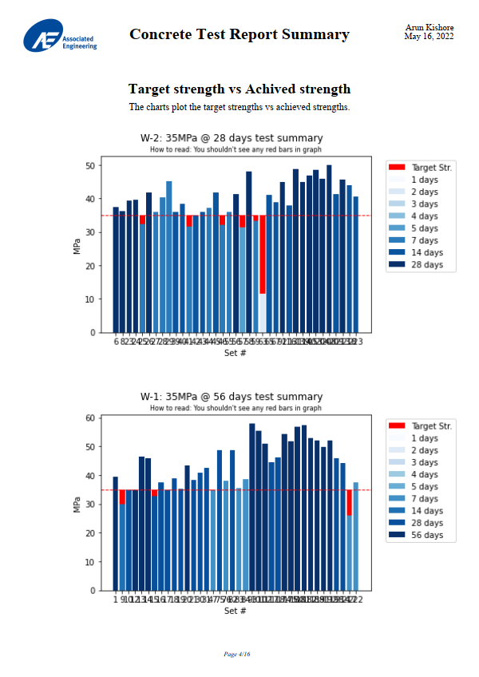
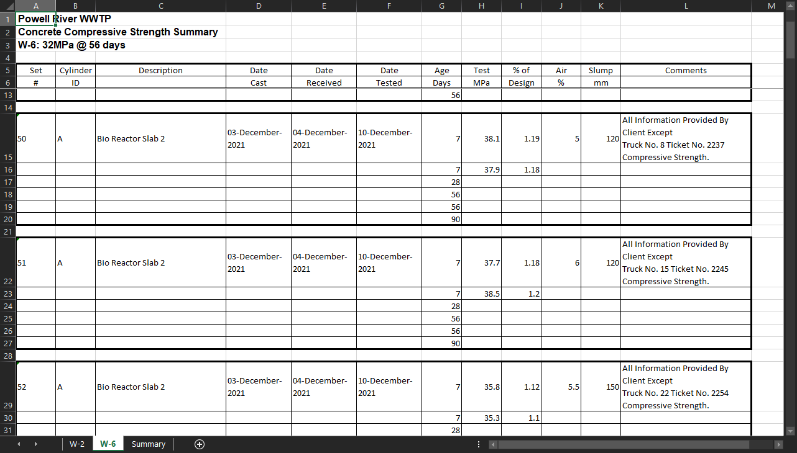

- [1. Concrete Test Results](#1-concrete-test-results)
  - [1.1. Screenshots](#11-screenshots)
    - [1.1.1. PDF Report](#111-pdf-report)
    - [1.1.2. Excel Compilation](#112-excel-compilation)
    - [1.1.3. How to use](#113-how-to-use)


# 1. Concrete Test Results
This is a Jupyter notebook script that programmically reads and extracts data out of concrete test reports and generates the following:
1. Excel sheet with the compiled data grouped by mix-type
2. PDF summary of the compiled data with the following additional verifications
      - Target vs Achived strength graph to quickly check if req. strength is achieved
      - Checks for Air content % to meet specified range
      - Checks for slump to meet specified range

## 1.1. Screenshots
### 1.1.1. PDF Report
 | 

### 1.1.2. Excel Compilation


### 1.1.3. How to use
1. Install required packages using 
```
pip install -r requirements.txt
```
2. In the file `Extract_from_PDF.ipynb` update the `folder` to point to the folder with the concrete test reports
3. Run all cells under `Imports`, `Classes`, `Process PDF Files`
4. Review the code under `User Input Needed` sections to ensure it matches the desired output.
5. Run all the rest of the sections.