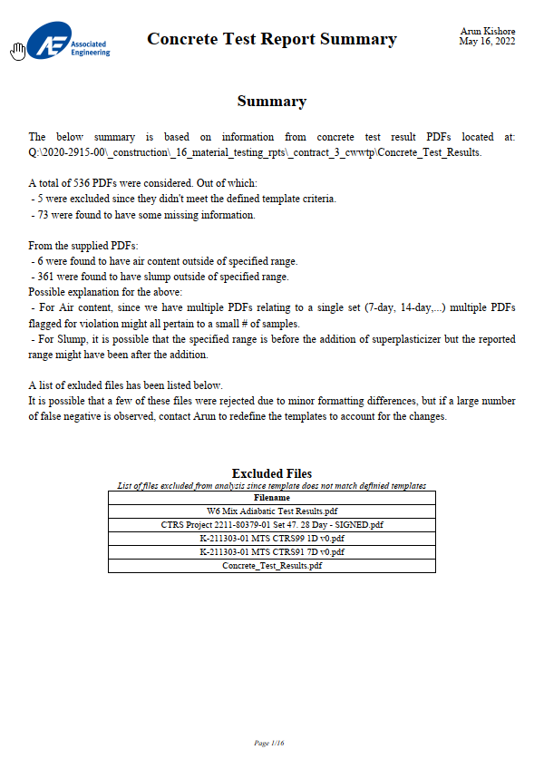
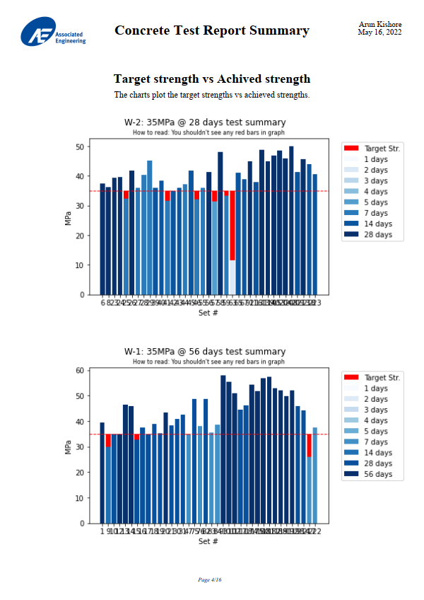
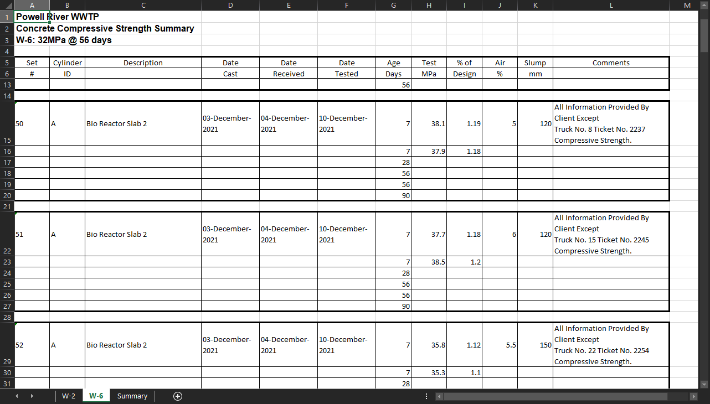

<!--- Heading --->
<div align="center">
  
  <h1>Concrete Test Results Summary</h1>
  <p>
    Generate a concise and brief summary of all concrete test result PDFs, to aid in fast and efficient review
  </p>
<h4>
    <a href="https://github.com/rpakishore/Concrete_Test_Results#11-screenshots">View Demo</a>
  <span> · </span>
    <a href="https://github.com/rpakishore/Concrete_Test_Results#2-getting-started">Documentation</a>
  <span> · </span>
    <a href="https://github.com/rpakishore/Concrete_Test_Results/issues/">Report Bug</a>
  <span> · </span>
    <a href="https://github.com/rpakishore/Concrete_Test_Results/issues/">Request Feature</a>
  </h4>
</div>
<br />


<!-- Table of Contents -->
<h2>Table of Contents</h2>  

- [1. About the Project](#1-about-the-project)
  - [1.1. Screenshots](#11-screenshots)
  - [1.2. Features](#12-features)
- [2. Getting Started](#2-getting-started)
  - [2.1. Prerequisites](#21-prerequisites)
  - [2.2. Dependencies](#22-dependencies)
- [3. Supported Material Testing Framework](#3-supported-material-testing-framework)
- [4. License](#4-license)
- [5. Contact](#5-contact)
- [6. Acknowledgements](#6-acknowledgements)

<!-- About the Project -->
## 1. About the Project
This is a Jupyter notebook script that programmically reads and extracts data out of concrete test reports into a summarized excel file and PDF summary report
<!-- Screenshots -->
### 1.1. Screenshots
<div align="center"> 
  
  
  
</div>

<!-- Features -->
### 1.2. Features
PDF summary of the compiled data with the following additional verifications  
  - Target vs Achived strength graph to quickly check if req. strength is achieved  
  - Checks for Air content % to meet specified range
  - Checks for slump to meet specified range

## 2. Getting Started

<!-- Prerequisites -->
### 2.1. Prerequisites

### 2.2. Dependencies
Create the virutual environment and install dependencies

```bash
pip install -r requirements.txt
```

<!-- Roadmap -->
## 3. Supported Material Testing Framework

This project will always remain a work in progress. A list of supported material testing report formats are shown below. More will be added in the future. 

If you would like to see a particular company, please open up a [new issue](https://github.com/rpakishore/Concrete_Test_Results/issues/)

| Company | Status |
|---------|--------|
| McElhanney | ✔️ |
| Kontur Geotechnical Consultants | ✔️ |

<!-- License -->
## 4. License
Distributed under the no License. See LICENSE.txt for more information.

<!-- Contact -->
## 5. Contact

Arun Kishore - <a href="mailto:pypi@rpakishore.co.in?subject=[Concrete Test Results Summary]">@rpakishore</a>

Project Link: [https://github.com/rpakishore/Concrete_Test_Results](https://github.com/rpakishore/Concrete_Test_Results/)

<!-- Acknowledgments -->
## 6. Acknowledgements

Use this section to mention useful resources and libraries that you have used in your projects.

 - [Awesome README Template](https://github.com/Louis3797/awesome-readme-template/blob/main/README-WITHOUT-EMOJI.md)
 - <a href="https://www.flaticon.com/free-icons/report" title="report icons">Report icons created by Freepik - Flaticon</a>
